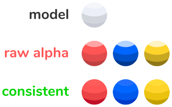

# consistent-shading


Shade consitency for various hues, based on luminance.



## Installation

For the npm package, use\:

```bash
npm install --save consistent-shading
```

For the ECMAScript module in browsers, use\:

```html
<script src="https://cdn.jsdelivr.net/npm/consistent-shading@latest/dist/esm/index.js"></script>
```

For the minfied module *(only ~750 bytes!)* in browsers, use\:

```html
<script src="https://cdn.jsdelivr.net/npm/consistent-shading@latest/dist/index.min.js"></script>
```

## Problem

The colour spectrum differs in luminance, at maximum saturation. As such, applying the same shadows throughout your design will create uneven colouring, due to the difference in *contrast*.

Finding aesthetically pleasing combinations of shadows and highlights is difficult enough for one colour, but getting consistent shading with a varied pallete can be really time consuming.

## Solution

The easiest solution lies in the new HCL (or LCH) colour format, which manages to separate luminance into an independent parameter.

To use this library you have to provide an *ideal base colour*, along with an array of *ideal shades*, that you have found through experimentation and determined to be fitting for your design.

After providing these in your format of choice\* pick a new base colour and feed it into the generator. This will cause it to return an array of relevant, *contrast consistent* shades, that *look pleasing*, just like the shaded base colour.

## Usage

> [!TIP]
> Try to pick base colours that are not on either extremes of the luminance spectrum, since the generator caps at the maximum and minimum levels. (You can't obtain a color darker than black)

```typescript
import { Color, ConsistentShading } from 'consistent-shading';

const IdealBaseColor = new Color('hex', ['#3454D1']);

const IdealShades = [
    new Color('rgb', [122, 143, 225]),
    new Color('lab', [31, 28, -58]),
    new Color('cmyk', [27, 22, 0, 7])
];

const Generator = new ConsistentShading(IdealBaseColor, IdealShades);

const AnyColor = new Color('hsl', [345, 63, 51]);

Generator.generate(AnyColor);
// => Array of Color objects, representing shades of AnyColor.
```

## API Description

### Color formats\*

The color formats are taken directly from the [color-convert](https://www.npmjs.com/package/color-convert) package. These are as follows:

```typescript
'rgb' | 'hsl' | 'hsv' | 'hwb' | 'cmyk' | 'xyz' | 'lab' | 'lch' | 'hex' | 'keyword' | 'ansi16' | 'ansi256' | 'hcg' | 'apple' | 'gray';
```

### Color class

Color is provided with two fields, one of which is the `value`, that is mostly a tuple of varying sizes (check [this](../blob/master/src/colors.ts) for more details), and the other is the `format`, which enables the library to correctly interpret your colours and convert them accordingly.

```typescript
const myColor = new Color('rgb', [255, 0, 255]);
```

<details>
  <summary>Implementation</summary>

```typescript
export class Color {
    public value: ColorFormat;

    public format: ColorFormatLabel;

    public constructor(format: ColorFormatLabel, value: ColorFormat) {
        this.value = value;
        this.format = format;
    }
}
```

</details>

### Generator class

The ConsistentShading class, which is in basic terms the shade generator and main functionality of this library (thus taking it's name), contains an important construrctor, which takes as a first paramenter the base `Color` and an array of shades, that are represented through an array `Color[]`.

After it has calculated the relative luminances of the provided shades, the `generator` method can be used. This method has a first mandatory parameter, which is the new base color, and an optional second parameter, which specifies a preferred format for the resulting shades.

This method can be called as many times as it's needed, since it does not mutate any internal state of the object.

<details>
  <summary>Implementation</summary>

```typescript
public generate(base: Color, exportFormat?: ColorFormatLabel) {
        let exportFormatInUse: ColorFormatLabel;
        if (typeof exportFormat === 'undefined')
            exportFormatInUse = base.format;
        else
            exportFormatInUse = exportFormat;

        let exportedColors: Color[] = [];
        const lchBase: lch = convert[base.format]['lch'](base.value);
        this._deltas.forEach((delta: number) => {
            let lchGenerated: lch = lchBase;
            lchGenerated[0] += delta;
            lchGenerated[0] = Math.min(100, Math.max(0, lchGenerated[0]));
            const generatedColor = new Color(exportFormatInUse, convert['lch'][exportFormatInUse](lchGenerated));
            exportedColors.push(generatedColor);
        })
        return exportedColors;
    }
```

</details>

